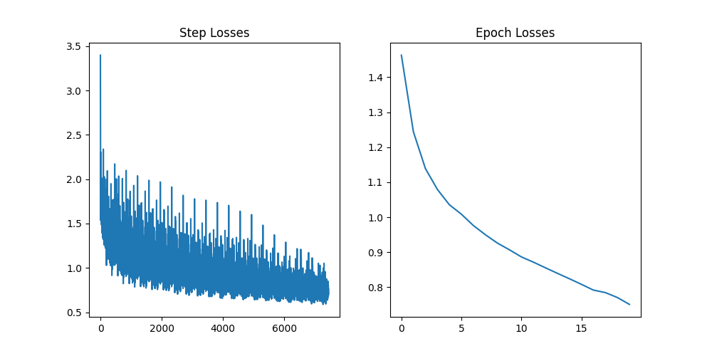
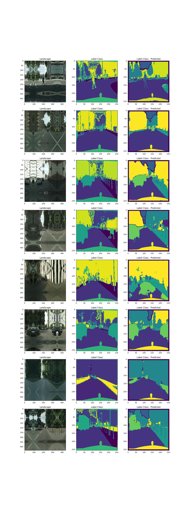

# UNet Architecture build

- Dataset:
  
  https://www.kaggle.com/dansbecker/cityscapes-image-pairs

- image size 256 x 256

- overlap tile -> input(padded) size 440 // output size 256

- train loss (epoch20)

- test_inference

  
